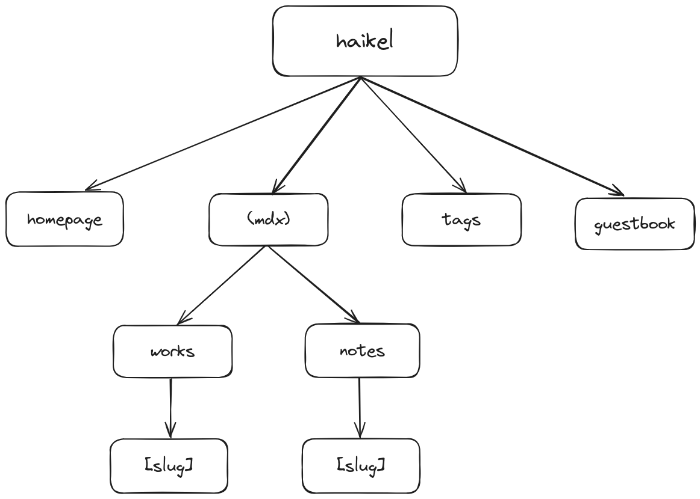

  <h1>haikel</h1>
  
My Personal Website. Always WIP.

## Stuff

- Next JS
- Typescript
- Uno CSS
- Contentlayer
- Jotai
- React Query
- tRPC
- Turso DB
- Drizzle

## Website Structure

## Color Pallete

- **base-0**: #0D1117
- **base-1**: #161B22
- **base-2**: #21262D
- **base-3**: #89929B
- **base-4**: #C6CDD5
- **base-5**: #ECF2F8

## License

See the [License](https://github.com/haikelz/haikel/blob/master/LICENSE).
